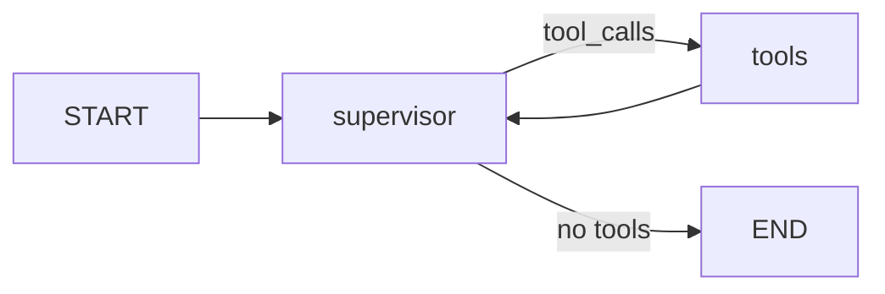

# AI Librarian v2.0

**LangGraph ReAct Agent 기반 지능형 질의응답 시스템**

---

## 프로젝트 개요

AI Librarian은 **LangGraph**를 활용한 ReAct(Reasoning + Acting) 에이전트 시스템입니다. 웹 검색을 통해 사용자 질문에 최적의 답변을 제공합니다.

### 핵심 특징

| 특징 | 설명 |
|------|------|
| **ReAct 패턴** | Think-Act-Observe 사이클로 추론 과정 투명화 |
| **멀티 프로바이더** | OpenAI GPT-4o, Google Gemini 2.0 Flash 지원 |
| **웹 검색** | DuckDuckGo 기반 실시간 웹 검색 |
| **실시간 스트리밍** | SSE 기반 토큰 단위 응답 |
| **세션 관리** | 대화 히스토리 유지 |

---

## 시스템 아키텍처

```
┌─────────────────────────────────────────────────────────────────┐
│                         Client (Browser)                         │
│                         static/index.html                        │
└─────────────────────────────────────────────────────────────────┘
                                  │
                                  ▼
┌─────────────────────────────────────────────────────────────────┐
│                      FastAPI Server (main.py)                    │
│  ┌─────────────┐  ┌─────────────┐  ┌─────────────────────────┐  │
│  │   /health   │  │   /chat     │  │   /chat/stream (SSE)    │  │
│  └─────────────┘  └─────────────┘  └─────────────────────────┘  │
└─────────────────────────────────────────────────────────────────┘
                                  │
                                  ▼
┌─────────────────────────────────────────────────────────────────┐
│                    Supervisor (LangGraph Agent)                  │
│                                                                  │
│   ┌───────────┐    ┌───────────┐    ┌───────────────────────┐   │
│   │  Adapter  │◄──►│   Graph   │◄──►│      Tool Node        │   │
│   │(OpenAI/   │    │  (ReAct)  │    │ (think/rag/web)       │   │
│   │ Gemini)   │    └───────────┘    └───────────────────────┘   │
│   └───────────┘                                                  │
└─────────────────────────────────────────────────────────────────┘
                                  │
                                  │
                    ┌─────────────┴─────────────┐
                    ▼                           ▼
             ┌───────────┐               ┌───────────┐
             │   think   │               │ WebWorker │
             │  (생각)   │               │(DuckDuckGo)│
             └───────────┘               └───────────┘
```

### LangGraph 워크플로우



---

## 기술 스택

| 영역 | 기술 | 버전 |
|------|------|------|
| 언어 | Python | 3.12+ |
| AI 프레임워크 | LangChain, LangGraph | 0.3.x, 0.2.x |
| LLM | OpenAI, Google Gemini | GPT-4o, Gemini 2.0 Flash |
| 웹 검색 | DuckDuckGo | ddgs 5.x |
| 웹 프레임워크 | FastAPI | 0.127+ |
| 패키지 관리 | uv | - |

---

## 디렉토리 구조

```
poc/
├── src/
│   ├── adapters/           # LLM 프로바이더 추상화
│   │   ├── base.py         # BaseLLMAdapter (인터페이스)
│   │   ├── openai.py       # OpenAI 어댑터
│   │   └── gemini.py       # Gemini 어댑터
│   ├── api/                # FastAPI 레이어
│   │   ├── app.py          # 앱 설정
│   │   ├── routes.py       # 엔드포인트
│   │   └── schemas.py      # 요청/응답 모델
│   ├── memory/             # 대화 히스토리
│   │   ├── base.py         # ChatMemory (인터페이스)
│   │   └── in_memory.py    # In-Memory 구현
│   ├── schemas/            # 데이터 모델
│   │   └── models.py       # Pydantic 모델
│   ├── supervisor/         # LangGraph 에이전트
│   │   ├── supervisor.py   # Supervisor 클래스
│   │   ├── prompts.py      # 시스템 프롬프트
│   │   └── tools.py        # 도구 정의
│   └── workers/            # 검색 워커
│       ├── base.py         # BaseWorker (인터페이스)
│       └── web_worker.py   # 웹 검색
├── tests/                  # 테스트 코드
├── static/                 # 프론트엔드
│   └── index.html          # 웹 UI
├── config.py               # 설정 관리
├── main.py                 # 서버 엔트리포인트
├── pyproject.toml          # 프로젝트 설정
└── CODE_REVIEW.md          # 코드리뷰 가이드
```

---

## 빠른 시작

### 1. 환경 설정

```bash
# 저장소 클론
git clone <repository-url>
cd ai-librarian/poc

# uv 설치 (없는 경우)
curl -LsSf https://astral.sh/uv/install.sh | sh

# 의존성 설치
uv sync
```

### 2. 환경 변수 설정

```bash
cp .env.example .env
```

`.env` 파일 편집:
```bash
# LLM 프로바이더 선택
LLM_PROVIDER=openai  # 또는 "gemini"

# OpenAI
OPENAI_API_KEY=sk-...
OPENAI_CHAT_MODEL=gpt-4o
OPENAI_EMBEDDING_MODEL=text-embedding-3-small

# Google Gemini (선택)
GOOGLE_API_KEY=...
GEMINI_MODEL=gemini-2.0-flash

# 프롬프트 설정
RESPONSE_LANGUAGE=Korean
AGENT_PERSONA=AI Librarian
```

### 3. 서버 실행

```bash
# 개발 모드 (자동 리로드)
uv run python main.py

# 또는
uv run uvicorn src.api:app --reload --host 0.0.0.0 --port 8000
```

브라우저에서 `http://localhost:8000` 접속

---

## API 엔드포인트

| Method | Path | 설명 |
|--------|------|------|
| GET | `/api/health` | 헬스 체크 |
| POST | `/api/chat` | 채팅 (비스트리밍) |
| POST | `/api/chat/stream` | 채팅 (SSE 스트리밍) |
| GET | `/api/sessions` | 세션 목록 |
| DELETE | `/api/sessions/{id}` | 세션 삭제 |
| DELETE | `/api/sessions/{id}/messages` | 메시지 초기화 |

### 요청 예시

```bash
# 비스트리밍
curl -X POST http://localhost:8000/api/chat \
  -H "Content-Type: application/json" \
  -d '{"message": "LangGraph란 무엇인가요?"}'

# 스트리밍 (SSE)
curl -N http://localhost:8000/api/chat/stream \
  -H "Content-Type: application/json" \
  -d '{"message": "최신 AI 트렌드 알려줘"}'
```

### 스트리밍 이벤트 타입

| 이벤트 | 설명 |
|--------|------|
| `token` | LLM 토큰 출력 |
| `think` | 생각 과정 |
| `act` | 도구 호출 |
| `observe` | 도구 결과 |
| `done` | 스트림 완료 |
| `error` | 에러 발생 |

---

## 테스트

```bash
# 전체 테스트
uv run pytest tests/ -v

# 커버리지 포함
uv run pytest tests/ -v --cov=src --cov-report=html

# 특정 테스트
uv run pytest tests/test_supervisor.py -v
```

---

## 배포

### Docker

```bash
docker build -t ai-librarian .
docker run -p 8000:8000 --env-file .env ai-librarian
```

### Google Cloud Run

```bash
# Secret Manager 설정 (최초 1회)
uv run python setup_secrets.py

# 배포
./deploy.sh
```

자세한 내용은 [DEPLOYMENT_GUIDE.md](./DEPLOYMENT_GUIDE.md) 참조

---

## 설계 패턴

| 패턴 | 위치 | 용도 |
|------|------|------|
| **Adapter** | `src/adapters/` | LLM 프로바이더 추상화 |
| **Strategy** | `src/workers/` | 검색 방식 교체 |
| **Factory** | `src/workers/factory.py` | 워커 인스턴스 생성 |
| **Template Method** | `src/supervisor/prompts.py` | 동적 프롬프트 생성 |
| **DI** | `Supervisor` | 메모리 백엔드 교체 |

---

## 확장 가이드

### 새 LLM 프로바이더 추가

```python
# src/adapters/anthropic.py
from .base import BaseLLMAdapter, NormalizedChunk

class AnthropicAdapter(BaseLLMAdapter):
    def create_llm(self, model=None, temperature=0.7, max_tokens=4096):
        return ChatAnthropic(model=model or "claude-3-sonnet")

    def normalize_chunk(self, chunk):
        return NormalizedChunk(text=chunk.content)

    @property
    def provider_name(self):
        return "anthropic"
```

### 새 워커 추가

```python
# src/workers/custom_worker.py
from .base import BaseWorker

class CustomWorker(BaseWorker):
    @property
    def worker_type(self):
        return WorkerType.CUSTOM

    async def execute(self, query: str) -> WorkerResult:
        return self._create_result(query=query, content="...")
```

---

## 코드리뷰

코드리뷰 진행 시 [CODE_REVIEW.md](./CODE_REVIEW.md) 문서를 참조하세요.

**리뷰 체크리스트:**
1. 아키텍처 리뷰
2. 핵심 모듈 리뷰 (Supervisor, Adapter, Workers, Memory, API)
3. 프롬프트 엔지니어링 리뷰
4. 프론트엔드 리뷰
5. 보안 및 성능 리뷰
6. 테스트 커버리지

---

## 문제 해결

| 문제 | 해결 방법 |
|------|----------|
| API 키 오류 | `.env` 파일 확인, API 키 유효성 검증 |
| 스트리밍 중단 | 클라이언트 타임아웃, 프록시 설정 확인 |

---

## 참고 자료

- [LangChain 문서](https://python.langchain.com/)
- [LangGraph 가이드](https://langchain-ai.github.io/langgraph/)
- [OpenAI API 문서](https://platform.openai.com/docs)
- [FastAPI 문서](https://fastapi.tiangolo.com/)

---

## 라이선스

MIT License
