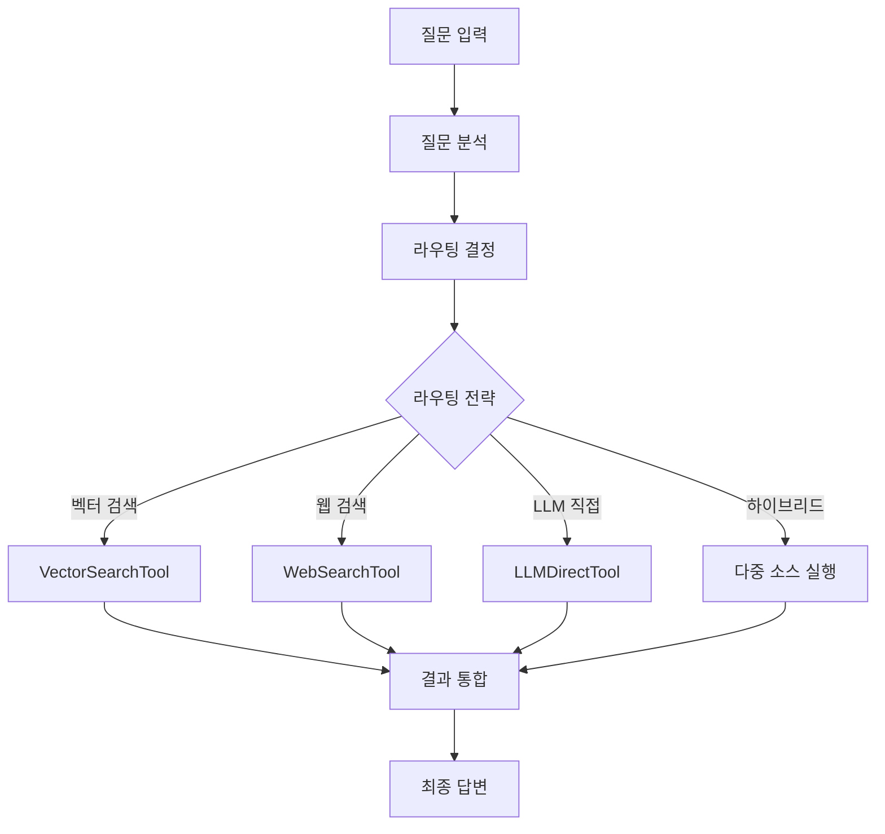

# 🚀 AI Research Project - LangChain/LangGraph RAG System

**LangChain과 LangGraph를 기반으로 한 지능형 질의응답 시스템**

## 📋 프로젝트 개요

이 프로젝트는 **LangChain**과 **LangGraph**를 활용하여 구축된 고도화된 RAG(Retrieval-Augmented Generation) 시스템입니다. 질문 유형을 자동으로 분석하고, 최적의 답변 소스를 지능적으로 라우팅하여 포괄적인 답변을 제공합니다.

### 🎯 핵심 특징

- ✅ **지능적 워크플로우**: LangGraph 기반 상태 관리 및 조건부 실행
- ✅ **다중 소스 통합**: 벡터 DB, 웹 검색, LLM 직접 답변의 하이브리드 조합
- ✅ **자동 라우팅**: 질문 유형에 따른 최적 답변 전략 선택
- ✅ **표준화된 아키텍처**: 업계 표준 LangChain 프레임워크 사용
- ✅ **실시간 모니터링**: 내장된 성능 추적 및 분석 기능
- ✅ **확장 가능한 설계**: 새로운 에이전트나 노드 쉽게 추가 가능

## 🏗️ 시스템 아키텍처

### 핵심 구성요소

```
📁 src/
├── langchain/              # LangChain/LangGraph 구현
│   ├── tools/             # LangChain Tools
│   │   ├── vector_search_tool.py    # 벡터 DB 검색
│   │   ├── web_search_tool.py       # 웹 검색
│   │   └── llm_direct_tool.py       # LLM 직접 답변
│   ├── graphs/            # LangGraph 워크플로우
│   │   └── question_answering_graph.py  # 메인 워크플로우
│   ├── services/          # 통합 서비스
│   │   └── langchain_answer_service.py  # 메인 답변 서비스
│   └── schemas/           # 데이터 스키마
├── models/                # 데이터 모델
├── services/              # 핵심 서비스
└── utils/                 # 유틸리티
```

### LangGraph 워크플로우



## 🔧 기술 스택

### 프레임워크 & 라이브러리

- **LangChain**: AI 애플리케이션 개발 프레임워크
- **LangGraph**: 복잡한 워크플로우 관리
- **Streamlit**: 웹 인터페이스
- **Python 3.12**: 메인 개발 언어

### AI & ML

- **OpenAI GPT-4o-mini**: 언어 모델
- **OpenAI Embeddings**: 텍스트 임베딩
- **Milvus**: 벡터 데이터베이스

### 개발 도구

- **uv**: 초고속 패키지 관리 (Poetry 대체)
- **Code**: Visual Studio Code
- **Pydantic**: 데이터 검증
- **Plotly**: 데이터 시각화

## 🚀 빠른 시작

### 1. 환경 설정

```bash
# 저장소 클론
git clone <repository-url>
cd ai-research

# uv 설치 (없을 경우)
curl -LsSf https://astral.sh/uv/install.sh | sh

# 의존성 설치
uv sync

# 환경 변수 설정
cp .env.example .env
# .env 파일에 API 키 설정
```

### 2. 환경 변수 (.env)

```bash
# OpenAI API
OPENAI_API_KEY=sk-your-openai-api-key

# Milvus (Zilliz Cloud)
ZILLIZ_HOST=https://your-cluster.zillizcloud.com
ZILLIZ_TOKEN=your-zilliz-token
```

### 3. 애플리케이션 실행

```bash
# Streamlit 앱 실행
uv run streamlit run streamlit_app.py

# 또는 간편 실행
python3 run_streamlit.py
```

브라우저에서 `http://localhost:8501` 접속

### 4. Google Cloud Run 배포 (Deployment)

본 프로젝트는 Google Cloud Run으로의 자동 배포를 지원합니다.

1. **Secret 동기화** (최초 1회):

   ```bash
   # 로컬 .env의 키를 Google Secret Manager로 업로드
   uv run python setup_secrets.py
   ```

2. **배포 실행**:
   ```bash
   # Cloud Build + Cloud Run 배포
   ./deploy.sh
   ```

## 📖 사용 방법

### 1. 샘플 데이터 추가

- **"📚 데이터 관리"** 탭에서 "🔄 샘플 문서 추가" 버튼 클릭
- LangChain, 머신러닝 관련 샘플 문서가 벡터 DB에 저장됨

### 2. 질문하기

- **"🚀 질의응답"** 탭에서 자연어 질문 입력
- 시스템이 자동으로 질문 유형을 분석하고 최적의 답변 전략 선택
- 실시간으로 라우팅 정보와 성능 지표 확인 가능

### 3. 성능 분석

- **"📊 분석"** 탭에서 시스템 사용 통계 확인
- 소스별 사용 비율, 성공률, 평균 처리 시간 등 모니터링

## 🧪 테스트 예시

### 권장 테스트 질문들

1. **복합적 질문**

   ```
   LangChain과 LangGraph의 차이점을 설명하고, 실제 프로젝트에서 어떻게 활용할 수 있는지 추천해주세요
   ```

2. **최신 정보 질문**

   ```
   2024년 최신 AI 기술 동향은 무엇인가요?
   ```

3. **기술적 질문**

   ```
   RAG와 파인튜닝의 차이점은 무엇인가요?
   ```

4. **일반 지식 질문**
   ```
   AI 개발자가 되기 위한 학습 로드맵을 추천해주세요
   ```

## 🎯 라우팅 전략

시스템은 질문 유형에 따라 6가지 라우팅 전략을 지원합니다:

- **vector_db_only**: 벡터 DB 단독 검색
- **web_search_only**: 웹 검색 단독
- **llm_direct_only**: LLM 직접 답변
- **hybrid_vector_llm**: 벡터 DB + LLM 조합
- **hybrid_web_llm**: 웹 검색 + LLM 조합
- **hybrid_all**: 모든 소스 통합

## 📊 성능 특징

| 특징          | 설명                                 |
| ------------- | ------------------------------------ |
| **처리 속도** | 평균 1-4초 (라우팅 전략에 따라 차이) |
| **정확도**    | 다중 소스 통합으로 높은 신뢰도       |
| **확장성**    | 새로운 Tool/Node 쉽게 추가 가능      |
| **모니터링**  | 실시간 성능 추적 및 분석             |

## 🔄 시스템 확장

### 새로운 Tool 추가

```python
from langchain.tools import BaseTool
from pydantic import BaseModel, Field

class CustomTool(BaseTool):
    name: str = "custom_tool"
    description: str = "Custom tool description"
    args_schema: type[BaseModel] = CustomInput

    def _run(self, query: str) -> Dict[str, Any]:
        # 커스텀 로직 구현
        return {"success": True, "result": "custom result"}
```

### 새로운 Graph Node 추가

```python
def custom_node(state: QuestionState) -> QuestionState:
    # 커스텀 노드 로직
    state['custom_result'] = process_custom_logic(state)
    return state

# 워크플로우에 노드 추가
workflow.add_node("custom_node", custom_node)
```

## 🐛 문제 해결

### 일반적인 문제들

1. **API 키 오류**

   - `.env` 파일의 `OPENAI_API_KEY` 확인
   - API 키 유효성 및 크레딧 잔액 확인

2. **Milvus 연결 오류**

   - `ZILLIZ_HOST`와 `ZILLIZ_TOKEN` 확인
   - 네트워크 연결 상태 확인

3. **메모리 부족**
   - 대용량 문서 처리 시 청크 크기 조정
   - 배치 처리 크기 감소

### 디버깅

```bash
# 로그 레벨 설정
export LOG_LEVEL=DEBUG

# 상세 로그와 함께 실행
uv run streamlit run streamlit_app.py
```

## 📚 참고 자료

- [LangChain 공식 문서](https://python.langchain.com/)
- [LangGraph 가이드](https://langchain-ai.github.io/langgraph/)
- [OpenAI API 문서](https://platform.openai.com/docs)
- [Milvus 문서](https://milvus.io/docs)

## 🤝 기여하기

1. Fork 프로젝트
2. Feature 브랜치 생성 (`git checkout -b feature/amazing-feature`)
3. 변경사항 커밋 (`git commit -m 'Add amazing feature'`)
4. 브랜치에 Push (`git push origin feature/amazing-feature`)
5. Pull Request 생성

## 📄 라이선스

이 프로젝트는 MIT 라이선스를 따릅니다. 자세한 내용은 `LICENSE` 파일을 참조하세요.

---

**🚀 LangChain/LangGraph로 더 스마트한 AI 시스템을 구축해보세요!**
